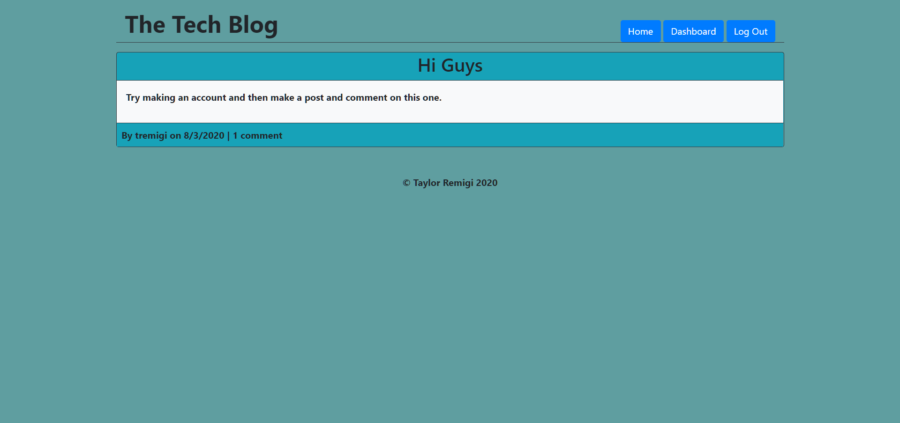

# The Tech Blog 
[(https://tremigi-tech-blog.herokuapp.com/)

## Description

The Tech Blog is a web app which utilizes node.js, express.js, mysql, sequelize, handlebars, and other packages to produce a CMS style tech blog platform. It follows the MVC paradigm.

## Table of Contents

* [Installation](#installation)
* [Usage](#usage)
* [Contributing](#contributing)
* [License](#license)
* [Testing](#testing)
* [Questions](#questions)

## Installation

Install MySQL, download zip from project repository, navigate to root folder of project in terminal and enter "npm i" to install dependencies. Create a .env file with necessary variables for local testing.

## Usage 

Create an account by clicking "Log In" in the navigation bar, then click "Sign Up Instead". Enter username (this will be public), email address, and password. Upon account creation you will be automatically logged in. Click "Dashboard" in the navigation bar to be taken to your personal dashboard, where you can create new posts, and view, edit, and delete your previous posts. Click on any post to view it and leave comments.

## License

This project is covered under the following license(s):

ISC

## Contributing

View, update, and create new issues from the GitHub Issues page.

## Testing

N/A

## Questions

GitHub Profile: [TRemigi](https://github.com/TRemigi)

Reach me via email at <tayremigi@gmail.com>

